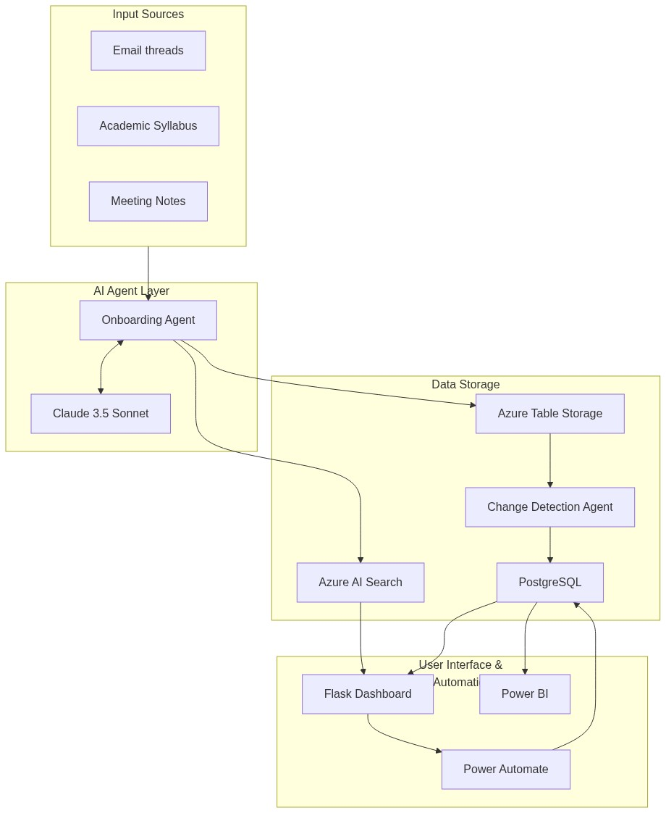
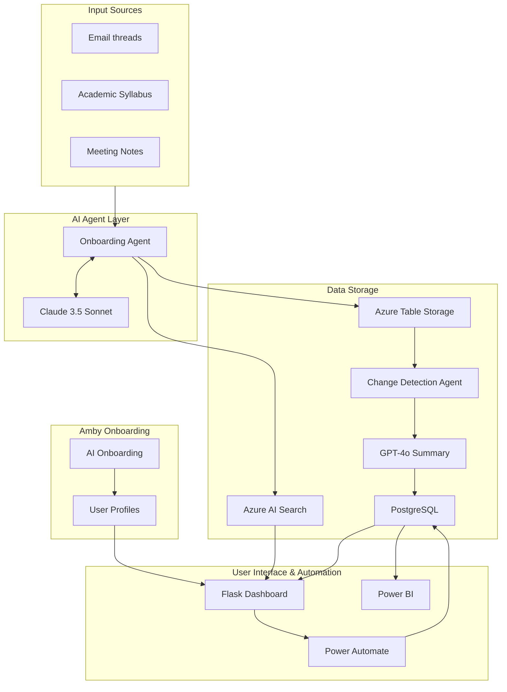

# 🚀 AmbitionOS — AI-Powered Personal Planner
> Microsoft Code Without Barriers Hackathon 2026

An agentic AI personal dashboard and project planner built with Microsoft Azure services.


📊 **Live Power BI Dashboard:** [View Dashboard](https://app.powerbi.com/groups/me/reports/d36551b2-29f7-42fb-9c8e-bead676b10a2/b91788b4030f6e70bb6b?experience=power-bi)

---

## 🏗️ Architecture





Full technical flow: **Unstructured Data** → **Onboarding Agent (Claude)** → **Azure Table Storage** → **Change Detection Agent** → **PostgreSQL** → **Human Approval (Dashboard)** → **Power BI**.

---

## ☁️ Azure Resources
| Resource | Name | Type | Location |
|---|---|---|---|
| Resource Group | `cwbAmbitionosRg` | Resource Group | Southeast Asia |
| Storage Account | `cwbambitionosstorage` | Storage V2 | East Asia |
| Table Storage | `ambitionosdata` | Azure Table | East Asia |
| AI Search | `cwb-ambitionos-search` | Search Service | East Asia |
| PostgreSQL | `cwb-ambitionos-db` | PostgreSQL Flexible | East Asia |
| AI Language | `cwb-ambitionos-language` | Cognitive Services | East Asia |

---

## 🛠️ Tech Stack
- **Python Flask** — Web framework
- **Azure Blob Storage** — File storage for meeting notes, emails, CSV
- **Azure Table Storage** — NoSQL task storage
- **Azure AI Language** — Text extraction and entity recognition
- **Azure AI Search** — Full-text search on tasks
- **Azure Database for PostgreSQL** — Relational task and change log storage
- **Power Automate** — Human-in-the-loop approval workflow
- **Power BI** — Visual analytics dashboard
- **GitHub** — Version control

---

## 📁 Project Structure
```
cwb-ambitionos/
├── .env                          # Azure credentials (never commit!)
├── .gitignore                    # Excludes .env and venv
├── requirements.txt              # Python dependencies
├── test_connection.py            # Azure connection test
├── upload_to_blob.py             # Upload data files to Blob Storage
├── export_for_powerbi.py         # Export tasks to CSV for Power BI
├── test_power_automate.py        # Test Power Automate flow
│
├── data/
│   ├── meeting_notes.txt         # Sample meeting notes
│   ├── email_threads.txt         # Sample email threads
│   ├── task_tracker_baseline.csv # Master task list (9 tasks)
│   └── powerbi_export.csv        # Exported tasks for Power BI
│
├── agents/
│   ├── extraction_agent.py       # Extracts tasks → Azure Table Storage
│   ├── search_agent.py           # Azure AI Search index management
│   └── change_detection_agent.py # Robust sync, mapping, and Claude AI summaries
│
├── database/
│   ├── db_setup.py               # Creates PostgreSQL tables
│   ├── sync_tasks.py             # Syncs Table Storage → PostgreSQL
│   └── fix_db_constraints.py     # Ensures constraints for ON CONFLICT logic
│
├── dashboard/
│   ├── app.py                    # Flask web app
│   └── templates/
│       └── index.html            # 5-tab dashboard UI
│
├── docs/
│   ├── architecture.md           # Mermaid source for architecture
│   └── architecture.png          # System architecture diagram
```

---

## ⚙️ Setup Instructions

### Prerequisites
- Python 3.11+
- Git
- Azure for Students subscription
- VS Code

### 1. Clone the Repository
```bash
git clone https://github.com/your-username/cwb-ambitionos.git
cd cwb-ambitionos
```

### 2. Create Virtual Environment
```bash
python -m venv .venv
.venv\Scripts\activate  # Windows
source .venv/bin/activate  # Mac/Linux
```

### 3. Install Dependencies
```bash
pip install flask azure-data-tables azure-storage-blob azure-ai-search-documents azure-ai-textanalytics psycopg2-binary sqlalchemy python-dotenv requests anthropic openai
```

### 4. Configure Environment Variables
Create a `.env` file in the root directory:
```env
# Azure Storage
AZURE_STORAGE_CONNECTION_STRING=DefaultEndpointsProtocol=https;AccountName=cwbambitionosstorage;AccountKey=...
AZURE_TABLE_NAME=ambitionosdata

# Azure AI Search
AZURE_SEARCH_ENDPOINT=https://cwb-ambitionos-search.search.windows.net
AZURE_SEARCH_KEY=your_search_key
AZURE_SEARCH_INDEX=ambitionos-index

# Azure AI Language
AZURE_LANGUAGE_KEY=your_language_key
AZURE_LANGUAGE_ENDPOINT=https://cwb-ambitionos-language.cognitiveservices.azure.com/

# PostgreSQL
POSTGRES_HOST=cwb-ambitionos-db.postgres.database.azure.com
POSTGRES_DB=postgres
POSTGRES_USER=ambitionosadmin
POSTGRES_PASSWORD=your_password
POSTGRES_PORT=5432

# Power Automate
POWER_AUTOMATE_URL=your_power_automate_url
```

### 5. Test Azure Connection
```bash
python test_connection.py
```

### 6. Upload Data Files
```bash
python upload_to_blob.py
```

### 7. Set Up Database
```bash
python database/db_setup.py
python database/sync_tasks.py
```

### 8. Run Extraction Agent
```bash
python agents/extraction_agent.py
```

### 9. Run Dashboard
```bash
cd dashboard
python app.py
```
Open 👉 http://127.0.0.1:5000

---

## 🤖 Agents

### Extraction Agent (`agents/extraction_agent.py`)
- Loads structured tasks from `task_tracker_baseline.csv`
- Extracts additional tasks from meeting notes and email threads using **Claude 3.5 Sonnet**
- Saves all tasks to Azure Table Storage and syncs to Azure AI Search

### Amby: AI Onboarding (`dashboard/templates/onboarding.html`)
- Personalized greeting and persona configuration (Student, Professional, Career Shifter)
- Dynamically configures dashboard tabs and task categories based on user needs
- Stores persistent user preferences in PostgreSQL `user_profiles`

### Change Detection Agent (`agents/change_detection_agent.py`)
- Compares tasks across 3 sources (Table Storage > CSV > PG)
- Implements robust normalization and field mapping
- Detects: new tasks, updated deadlines, status changes, priority changes
- Logs every change to PostgreSQL `change_logs` table
- Generates smart change summaries using **Azure OpenAI GPT-4o**
- Triggers Power Automate approval flow on detected changes
- Syncs updates to Azure AI Search automatically

---

## 🔄 Power Automate Flow
```
HTTP Trigger (task change detected)
        ↓
Start and wait for approval (assigned to Jaymee Santos)
        ↓
    Condition: Outcome == "Approve"
   ↙                              ↘
True (Approved)              False (Rejected)
Send approval email          Send rejection email
```

---

## 📊 Dashboard Features
- **Amby Onboarding** — Smart persona-driven setup wizard
- **Dashboard tab** — Today's priorities, stats, recent changes, and **One-Click Sync**
- **Dynamic Tabs** — Tab layouts (Gantt, Opportunities, Research) adapt to your persona
- **Search bar** — Powered by Azure AI Search with keyword and priority filtering
- **Coffee Chat** — A unique collaborator discovery vision for student and shifter networking

---

## 🗄️ PostgreSQL Schema
```sql
-- Tasks table
CREATE TABLE tasks (
    id SERIAL PRIMARY KEY,
    task VARCHAR(255),
    owner VARCHAR(100),
    due_date VARCHAR(100),
    status VARCHAR(50),
    category VARCHAR(100),
    priority VARCHAR(50),
    source VARCHAR(100),
    confidence VARCHAR(20) DEFAULT 'Medium',
    approval_status VARCHAR(20) DEFAULT 'Approved',
    extracted_at TIMESTAMP DEFAULT NOW()
);

-- Change logs table
CREATE TABLE change_logs (
    id SERIAL PRIMARY KEY,
    task_name VARCHAR(255),
    field_changed VARCHAR(100),
    old_value VARCHAR(255),
    new_value VARCHAR(255),
    changed_at TIMESTAMP DEFAULT NOW()
);
```

---

## 🛡️ Risk & Safety Evaluation
| Risk | Mitigation |
|---|---|
| PII in extracted tasks | Implemented owner field masking and input sanitization directly within the agent. |
| Hallucinated due dates | Utilized robust `confidence` field scoring paired with a Human-in-the-Loop approval workflow to catch LLM artifacts. |
| Prompt injection via email input | Strict input sanitization applied on unverified email strings before passing into LLMs. |
| API key exposure | Securely handled using `.env` file loading, strictly ignored by `.gitignore`. |

---

## 🤝 AI Tools Disclosure
The following AI tools were used in development natively to support dual models:
- **Claude 3.5 Sonnet (Anthropic)** — Agentic AI for task data extraction and task parameterization
- **Azure OpenAI GPT-4o** — AI summaries for automated task change reporting
- **GitHub Copilot** — Code completion

All AI-generated code has been reviewed and tested by the developer.

---

## 📅 Development Timeline
| Date | Milestone |
|---|---|
| Apr 6 | Repo setup + dataset files created |
| Apr 7 | Azure services configured |
| Apr 8 | Extraction agent + Flask dashboard live |
| Apr 8 | PostgreSQL connected + Power Automate flow working |
| Apr 8 | Power BI dashboard published live ✅ |
| Apr 9–11 | Azure AI Search setup |
| Apr 12–18 | Core agents + onboarding agent |
| Apr 19–25 | Dashboard polish + presentation |
| Apr 26–May 3 | Demo video + final submission |

---

## 👩‍💻 Developer
**Jaymee Santos**
Holy Angel University
jjsantos1@student.hau.edu.ph

---

## 📝 Prior Work Disclosure
The **SecondBrain** concept inspired the AmbitionOS personal dashboard idea. All code, agents, and Azure integrations were built fresh during the hackathon period (April 2–May 3, 2026).

---

*  💜 Built by Jaymee Santos *
