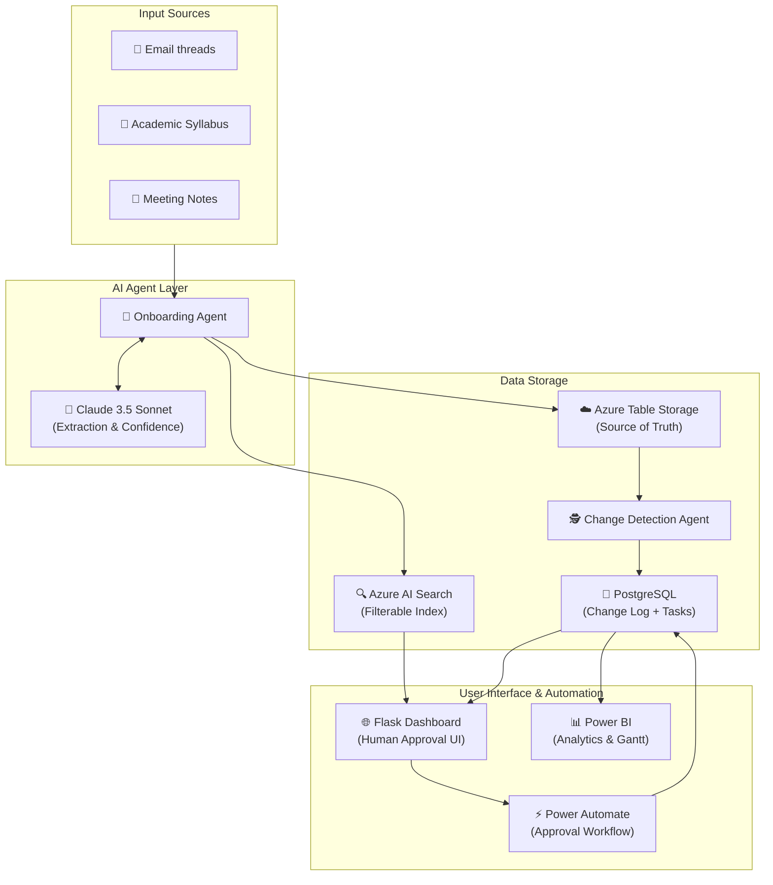

# AmbitionOS Platform Architecture

This diagram illustrates the full data flow of AmbitionOS, from source extraction to human approval and final visualization.

### Component Flow Description:
1.  **Sources**: Unstructured data from student life (emails, syllabi, notes).
2.  **Onboarding Agent**: Uses **Claude 3.5 Sonnet** to extract tasks and assign a confidence score.
3.  **Azure Table Storage**: Acts as the initial source of truth for extracted data.
4.  **Azure AI Search**: Provides fast, filterable search capabilities for the dashboard.
5.  **Change Detection Agent**: Compares new data with existing records, logging changes to **PostgreSQL**.
6.  **PostgreSQL**: Stores the processed tasks and a full audit trail of changes.
7.  **Flask Dashboard**: The main UI where users review tasks, see confidence scores, and perform **Human-in-the-Loop** approvals.
8.  **Power Automate**: Triggered for high-priority items to send approval emails and sync responses back to PostgreSQL.
9.  **Power BI**: Connects directly to PostgreSQL to provide advanced analytics, Gantt charts, and progress tracking.
